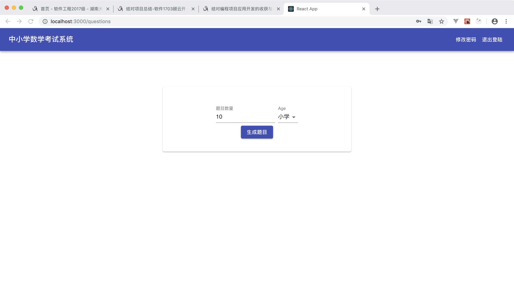
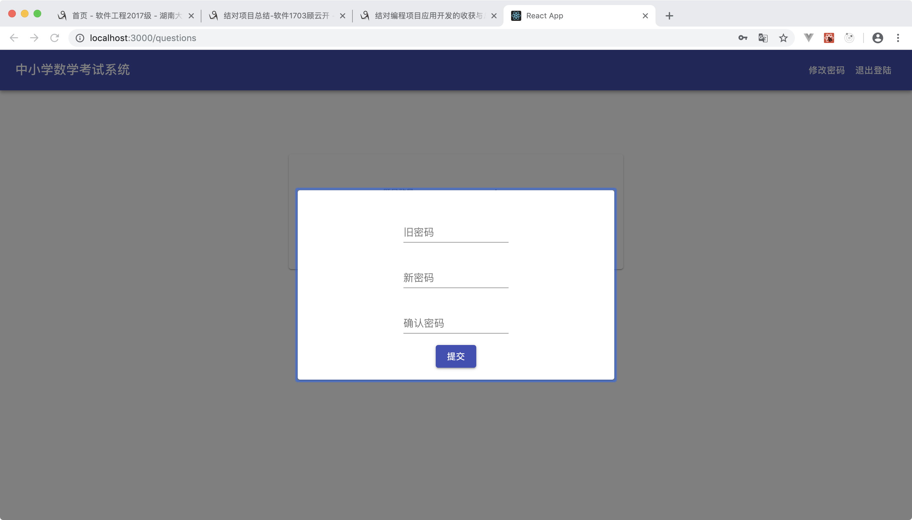
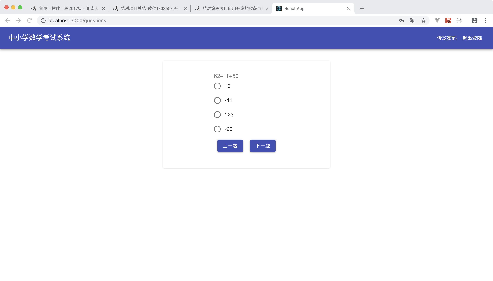
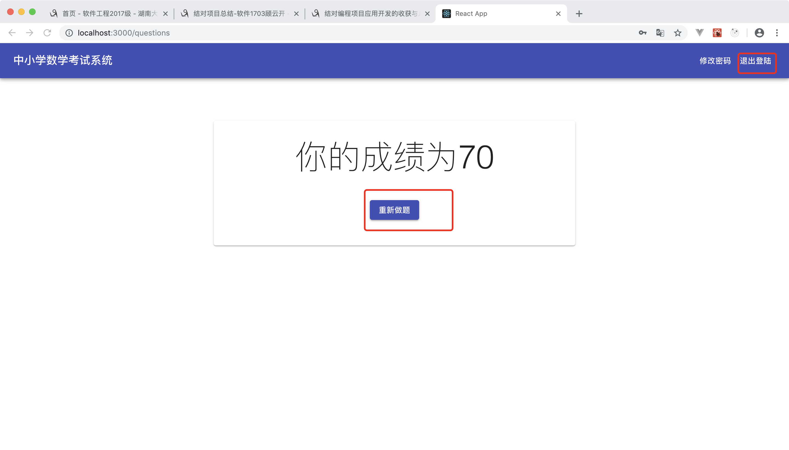

## 软件工程个人项目

本项目主要的需求如下：

- [x] 用户注册功能
  - [x] 手机验证码功能
  - [x] 输入两次密码匹配后设置密码成功（密码6-10位，必须含大小写字母和数字）
- [x] 修改密码功能
  - [x] 用户在登录状态下可修改密码
  - [x] 输入正确的原密码，再输入两次相同的新密码后修改
- [x] 题目参数设置
  - [x] 选择小学、初中和高中三个选项
  - [x] 输入需要生成的题目数量
- [x] 答题功能
  - [x] 生成一张试卷（同一张卷子不能有相同题目，题目全部为选择题，界面显示第一题的题干和四个选项）
  - [x] 最后一题提交后，界面显示分数（分数根据答对的百分比计算）
- [x] 分数界面可选择退出或继续做题
- [x] 小初高数学题目要求见个人项目

### 技术选择及运行

本项目前端主要使用的是`React`、`React-Router`、`Axios`三项技术构建的Web应用。

#### 运行方式

因为要上交代码包，所以没有将其打包，运行demo需要运行下面的命令（推荐使用yarn进行依赖管理）：

```shell
# 安装依赖
yarn install
# 运行React项目
yarn start
```

运行之后会自动打开浏览器，为前端效果。

### 主要难点

主要的难点在前端路由的控制方面，前端路由的答题界面的路由应该是私有的，所以根据`React-Router`官方的建议我们使用`Render Props`，对用户权限予以验证，具体的实现如下：

```js
import React, {useContext} from 'react'
import {Route, Redirect} from 'react-router-dom'
import {UserContext} from '../utils/context'

function PrivateRoute({component: Component, ...rest}) {
  const {user} = useContext(UserContext);

  return (
    <Route
      {...rest}
      render={props =>
        user !== '' ? (
          <Component {...props} />
        ) : (
          <Redirect
            to={{
              pathname: "/",
              state: {from: props.location}
            }}
          />
        )
      }
    />
  );
}

export default PrivateRoute;
```

还有一个难点是对于用户信息的多组件共享，我们简单的使用Context实现一个迷你的全局状态管理，具体实现如下：

```js
import React, {createContext, useState} from 'react';

export const UserContext = createContext(null);

export const TypeProvider = props => {
  const [user, setUser] = useState('');
  const [errorMessage, setErrorMessage] = useState('');

  return (
    <UserContext.Provider value={{user, setUser, errorMessage, setErrorMessage}}>
      {props.children}
    </UserContext.Provider>
  )
};

export const TypeConsumer = UserContext.Consumer;
```

对于Context的消费，我们使用`React Hooks`，具体说明可以查看官方文档。

### 运行效果


这是登陆界面，输入用户名密码即可登陆，注意的是用户名默认为注册用手机号码，接下来看一下注册界面。


这是用户的手机验证见面，输入正确的验证码之后就可以进入设置密码界面。


输入密码之后及注册成功成功跳转到设置密码界面设置密码后，重新回到登陆界面，接下来我们看看答题界面。



这是用户的出题界面，选择需要的参数，即可生成题目。



这是修改密码的接口，输入旧密码，并输入两次新密码之后完成密码的修改。



这是用户的答题界面，选择其中一个选项之后，点击上一题、下一题切换题目。



完成答题之后显示成绩，并且可以接着做题或者退出登陆。