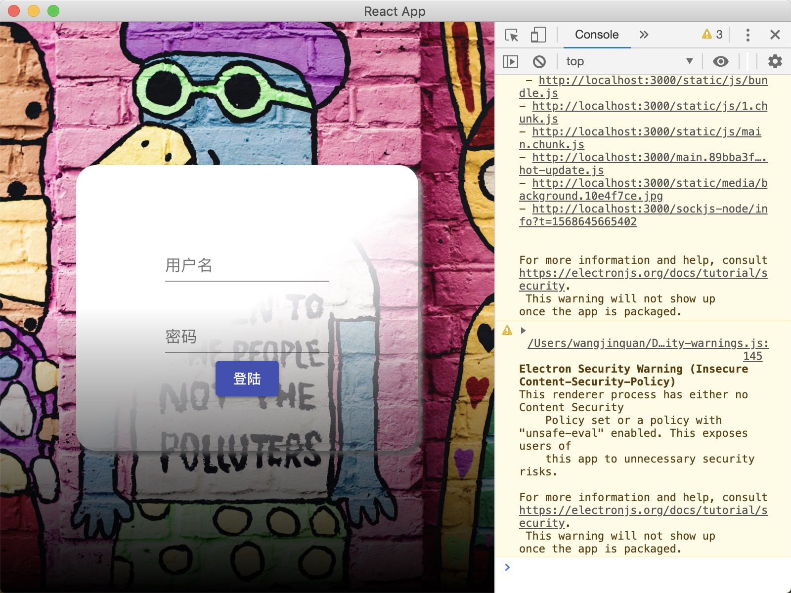
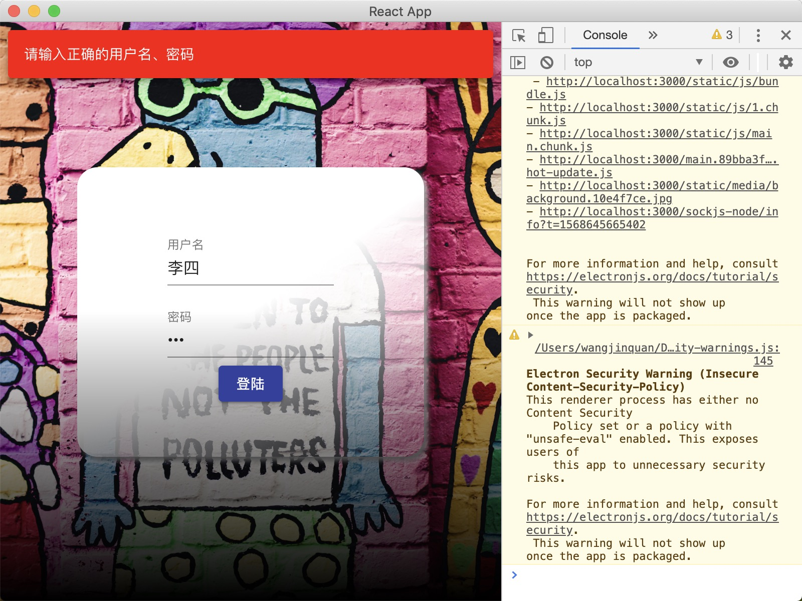
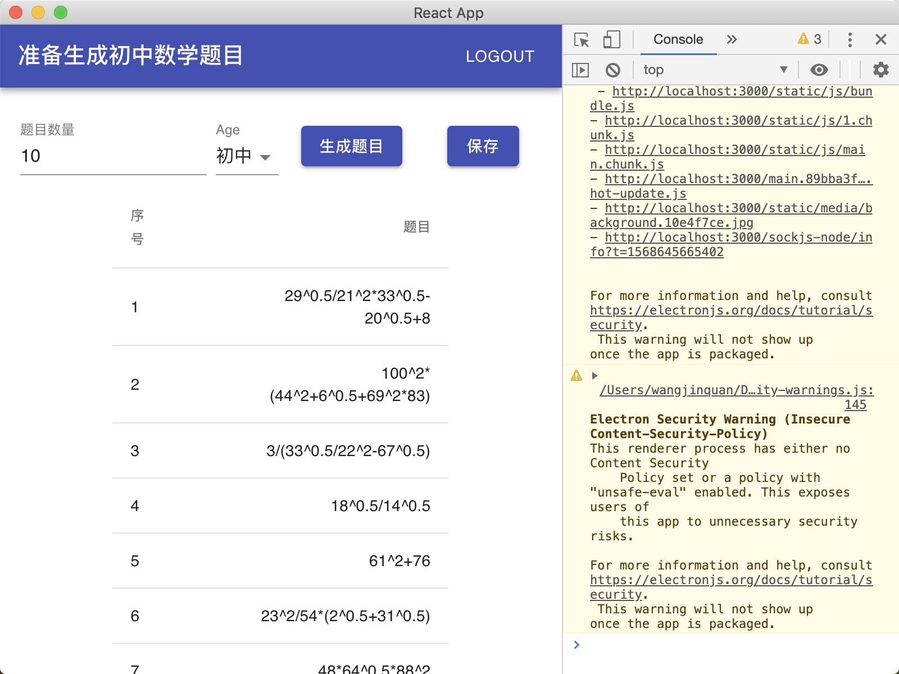
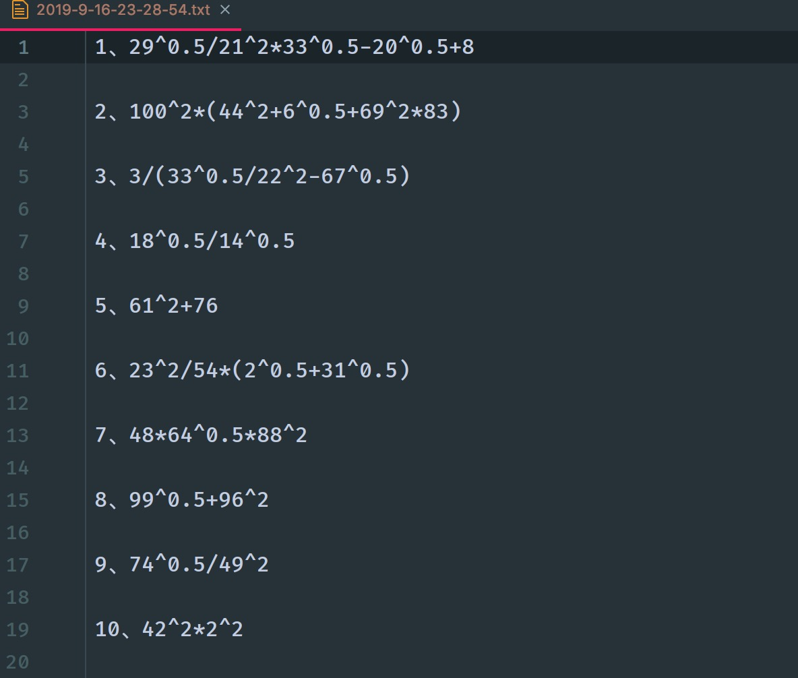

# 软件工程个人项目

本项目主要要完成的是，中小学数学试卷的生成工作。

## 主要技术

本项目主要使用的是`React`、`Electron`两项技术构建的桌面应用，这两项技术分别源自于`Facebook`与`Github`。业内最成功的应用包括但不限于`VSCode`。

## 运行方式

因为要上交代码包，所以没有将其打包为可执行文件，运行demo需要一次运行下面的命令（推荐使用yarn进行依赖管理）：

```shell
# 安装依赖
yarn install
# 运行React项目
yarn start
# 运行Electron外壳
yarn run dev
```

完成后可以看到，出现对应的桌面应用。

## 主要难点

在Electron应用中分为主进程与渲染进程。渲染进程可以理解为简单的浏览器窗口，主进程负责与宿主机进行交互，调用Node.js的API等。

存储文件以及查重的时候就涉及到渲染进程和主进程进行通信，调用Node的API进行文件操作（主要代码在`/main.js`与`/src/Views/question/index.js`中）。

## 运行效果



这是登陆界面，输入对应的用户名密码即可成功进入出题界面，并且有相应的错误提示：



这是出题界面，在上方的标题是可以改变的随着下方选择的类别的不同，LOGOUT按钮提供退出登陆的选项；下方的出题数目限制了数值的大小与只能输入数字，旁边的select可以改变出题的类型，旁边两个按钮的作用很明显。



生成了对应的题目，最后我们查看保存的文件是否正确：



可以看到我们生成的题目中既生成了题目的序号，中间还有空行，并且生成的文件格式也是正确的。